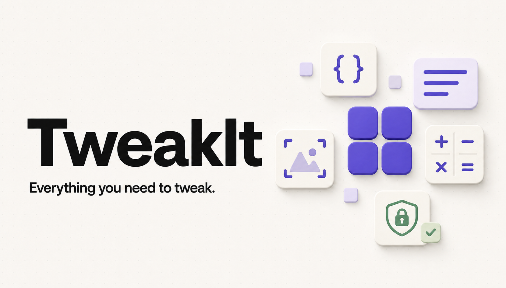

<p align="center">
  
</p>

<h1 align="center">TweakIt</h1>

<p align="center">
  <strong>Everything you need to tweak.</strong><br />
  Ferramentas rápidas, bilíngues e privadas para texto, dados, desenvolvimento, imagens, conversões e mais.
</p>

<p align="center">
  
</p>

<p align="center">
  <a href="#português">Português</a> · <a href="#english">English</a>
</p>

---

<a id="português"></a>

## Português

### O que é

O **TweakIt** é um site de utilitários online: encontre a ferramenta certa em segundos, use e siga em frente. A interface é bilíngue (PT-BR / EN), centrada em busca e pensada para privacidade.

### Features

- Catálogo amplo: texto, dados, desenvolvimento, imagens, conversões, medidas, matemática e mais
- Busca e command palette independentes do idioma da interface
- Processamento **local no navegador** na maior parte das ferramentas
- Favoritos e recentes salvos só no seu dispositivo
- Rotas compartilháveis para cada ferramenta
- Interface responsiva (mobile, tablet e desktop)
- Conversor de moeda com cotações ao vivo via API pública ([Frankfurter](https://www.frankfurter.app/))

### Privacidade e LGPD

O TweakIt foi desenhado com **privacidade por padrão**:

- Na maioria das ferramentas, o conteúdo que você digita **não é enviado a nenhum servidor** — o processamento acontece no seu navegador
- Preferências, favoritos e recentes ficam em `localStorage` no seu dispositivo
- Não usamos o conteúdo das ferramentas para treinar modelos, criar perfil de uso ou vender dados pessoais
- Ferramentas que precisam de rede (ex.: cotação de moeda) buscam apenas dados públicos necessários; o valor informado continua no cliente
- Você pode limpar os dados locais a qualquer momento pelas configurações do navegador

Em termos de LGPD (Lei nº 13.709/2018), o site prioriza **minimização de dados**: não coletamos dados pessoais das entradas das ferramentas para operação do produto. Se no futuro houver telemetria ou cookies não essenciais, isso será documentado de forma clara e, quando aplicável, com consentimento.

### Uso comercial

O código está sob a licença **MIT** (veja [`LICENSE`](LICENSE)):

- Uso pessoal e **comercial** são permitidos
- Você pode modificar, redistribuir e incorporar o TweakIt em produtos próprios
- A única obrigação é manter o aviso de copyright e a licença MIT nas cópias do software
- O software é oferecido “como está”, sem garantias

> O catálogo e alguns padrões funcionais foram estudados a partir do [IT-Tools](https://github.com/CorentinTh/it-tools) (GNU GPLv3). A implementação do TweakIt foi escrita de forma independente.

### Como instalar

Requisitos: **Node.js ≥ 22.13**

```bash
git clone https://github.com/ubyss/-tweakIt.git
cd -tweakIt
npm install
npm run dev
```

Abra o endereço indicado no terminal (em geral `http://localhost:3000`).

### Scripts úteis

```bash
npm run dev        # desenvolvimento
npm run build      # build de produção
npm run start      # servir build
npm run typecheck  # TypeScript
npm run lint       # ESLint
npm test           # testes
```

### Como contribuir

1. Faça um fork e crie uma branch descritiva (`feat/nome`, `fix/nome`, `docs/nome`)
2. Mantenha o escopo focado — uma feature ou correção por PR
3. Siga os padrões do projeto (TypeScript, componentes coesos, CSS BEM semântico)
4. Atualize textos em **PT-BR e EN** quando a mudança afetar a interface ou o catálogo
5. Abra um Pull Request explicando o *porquê* da mudança

Sugestões de contribuição: novas ferramentas no catálogo, melhorias de acessibilidade, performance, testes e tradução.

### Estrutura rápida

- `app/` — rotas e layout
- `components/` — UI (shell, busca, ferramentas)
- `lib/catalog/` — definição bilíngue das ferramentas
- `lib/tools/` — lógica de processamento
- `public/` — favicon, Open Graph e assets estáticos

---

<a id="english"></a>

## English

### What it is

**TweakIt** is an online utilities site: find the right tool in seconds, use it, and move on. The UI is bilingual (PT-BR / EN), search-first, and built around privacy.

### Features

- Broad catalog: text, data, development, images, conversions, measurements, math, and more
- Search and command palette that work across UI languages
- **Local-in-browser** processing for most tools
- Favorites and recents stored only on your device
- Shareable routes for every tool
- Responsive UI (mobile, tablet, and desktop)
- Currency converter with live rates from a public API ([Frankfurter](https://www.frankfurter.app/))

### Privacy & LGPD

TweakIt is **private by default**:

- For most tools, your input is **never sent to a server** — processing runs in your browser
- Preferences, favorites, and recents live in `localStorage` on your device
- We do not use tool inputs to train models, build usage profiles, or sell personal data
- Network tools (e.g. currency rates) fetch only the public data they need; your amount stays on the client
- You can clear local data anytime from your browser settings

Aligned with Brazil’s LGPD (Law No. 13.709/2018), the product prioritizes **data minimization**: tool inputs are not collected as personal data to operate the site. If non-essential telemetry or cookies are added later, that will be documented clearly and, where required, with consent.

### Commercial use

The code is released under the **MIT** license (see [`LICENSE`](LICENSE)):

- Personal and **commercial** use are allowed
- You may modify, redistribute, and embed TweakIt in your own products
- Keep the copyright notice and MIT license text with copies of the software
- The software is provided “as is”, without warranty

> The catalog and some functional patterns were studied from [IT-Tools](https://github.com/CorentinTh/it-tools) (GNU GPLv3). TweakIt’s implementation was written independently.

### Install

Requires **Node.js ≥ 22.13**

```bash
git clone https://github.com/ubyss/-tweakIt.git
cd -tweakIt
npm install
npm run dev
```

Open the URL shown in the terminal (usually `http://localhost:3000`).

### Useful scripts

```bash
npm run dev        # development
npm run build      # production build
npm run start      # serve build
npm run typecheck  # TypeScript
npm run lint       # ESLint
npm test           # tests
```

### Contributing

1. Fork and create a descriptive branch (`feat/name`, `fix/name`, `docs/name`)
2. Keep PRs focused — one feature or fix per pull request
3. Follow project conventions (TypeScript, cohesive components, semantic BEM CSS)
4. Update **PT-BR and EN** copy when UI or catalog text changes
5. Open a Pull Request that explains *why* the change matters

Good contribution ideas: new catalog tools, accessibility, performance, tests, and translation.

### Quick structure

- `app/` — routes and layout
- `components/` — UI (shell, search, tools)
- `lib/catalog/` — bilingual tool definitions
- `lib/tools/` — processing logic
- `public/` — favicon, Open Graph, and static assets

---

## License

[MIT](LICENSE) © 2026 TweakIt contributors
